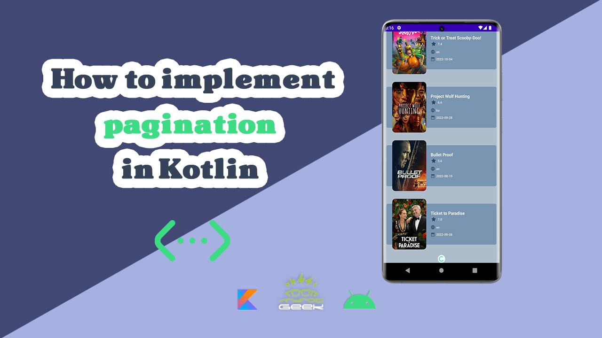

# Paging-Youtube

</a>

YouTube Video :
   

 

Article on Medium:
 
https://androidgeek.co/how-to-implement-pagination-in-kotlin-retrofit-hilt-paging-baa620cf5b50
 
 

✨ Join Medium to read thousands of valuable stories ✨
 
https://medium.com/@ezatpanah/membership
